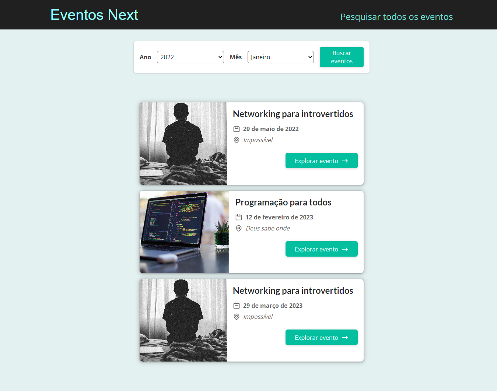

# Next Eventos

## Descrição

Teste de projeto utilizando next para gerenciar eventos.

## Detalhes

● Desenvolvi uma aplicação em Next.js para a descoberta e agregação de eventos com data fetching e roteamento
dinâmico.

● Consumi o layout system do Next.js para maior dinamicidade entre as rotas e facilidade na criação de novas páginas.

## Link para acesso

- https://next-eventos.vercel.app/

## Prévia

